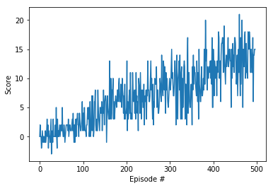

## Learning Algorithm

The agent is trained with the (Vanilla) [DQN algorithm](https://storage.googleapis.com/deepmind-media/dqn/DQNNaturePaper.pdf). The full algorithm is described in the METHODS section of the paper.
- We initialize the replay memory `D` to some capacity `N`.
- We initialize the local Q-Network (which should approximate the true action-value function Q) with random weights (using PyTorch default weight initialization for any module).
- We copy those generated weights to the target Q-Network (which shall be updated every some defined number of iterations).
- We train the agent for some episodes and for some maximum number of time-steps (`max_t`) in each episode, unless it terminates earlier (e.g. by encountering a terminal state).
- The training loop is composed out of two steps: sampling and learning.
- In the sampling step, the agent follows a behavioral (epsilon-greedy) policy, which given a state `s` returns an action `a`. It executes this action `a` and observes reward `r` and next state `s'`. The experince tuple (`s`, `a`, `r`, `s'`, `d`), where `d` is a boolean flag which denotes whether the episode will terminate in state `s'`, is stored in the replay buffer D.
- In the learning step, the agent samples uniformly at random a mini-batch of experience tuples from `D`.
- It uses these experience tuples to compute the targets by following a target (greedy) policy. The mean squared error between the target and expected action-values is computed and this TD-error is backpropagated in the *local* Q-Network so to update the weights using one step of SGD.
- Next, we update the *target* Q-Network weights by making a copy of the current weights of the local Q-Network.

**Architecture Neural Network Q-function**

- input size = 37
- output size = 4
- 2 hidden layers and one output layer
- each hidden layer has 64 hidden units and is followed by a `ReLU` activation layer
- output layer is followed by a linear activation layer

**Hyperparameters**

```
BUFFER_SIZE = int(1e5) # capacity N of replay memory D
BATCH_SIZE = 64 # batch-size
GAMMA = 0.99 # discount factor
TAU = 1e-3 # soft-update factor (when updating the target network weights) 
LR = 5e-4 # learning rate for SGD
UPDATE_EVERY = 4 # when to update the local network weights
optimizer = ADAM
```

## Plot of Rewards



```
Episode 100	Average Score: 1.05
Episode 200	Average Score: 4.62
Episode 300	Average Score: 7.12
Episode 400	Average Score: 9.40
Episode 497	Average Score: 13.00
Environment solved in 397 episodes!	Average Score: 13.00
```

## Ideas for Future Work

- Implement a [double DQN](https://arxiv.org/abs/1509.06461), a [dueling DQN](https://arxiv.org/abs/1511.06581), and [prioritized experience replay](https://arxiv.org/abs/1511.05952)
- Solve the task given that the states are 2D images of the environment
